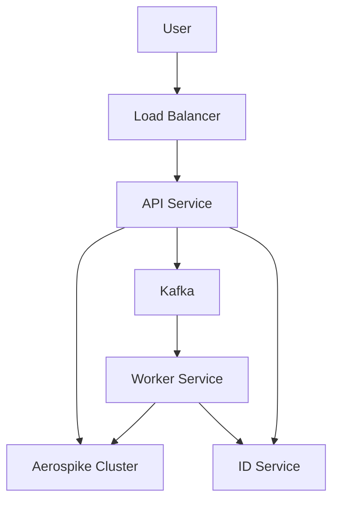

# Allezon

Allezon is deployed on bare-metal kubernetes cluster, using helm charts (`/charts` directory).


* API Service - REST api that handles requests
  * `/user_tags` - adds the tag to user's profile, and sends kafka event to worker.
  * `/user_profiles/:cookie` - reads user profile from aerospike
  * `/aggregates` - reads aggregates from aerospike
* Worker Service - processes messages received from kafka and updates the aggregates in aerospike.
* ID Service - assignes and returns the numerical ID to elements from a given collection. Collecion are one of "origin", "brand", "category".





# Kubernetes setup on RTB House provided vms
RTB House provides us with some vms to run our kubernetes cluster. This is a guide on how to set it up.

1. Create `.vms` file in the root of this repo following the example in `.vms_example` file.
In the `HOSTS` provide the ids of the vms that you want to use for your cluster (workers and masters).

2. You may want to re-deploy the vms to have a clean state. Go to the [jenkins](https://mimjenkins.rtb-lab.pl) and run the ReDeployVm job on the vms that you want to re-deploy.

3. Run 
    ```bash
    make cluster-setup
    ```


The `cluster` ansible inventory was generated as specified in the [kubespray quick start guide](https://github.com/kubernetes-sigs/kubespray#quick-start).
You may want to generate your own (replace hosts.yaml with your own). The `hosts-ips.sh` script can help you with obtaining the ips of the vms.

